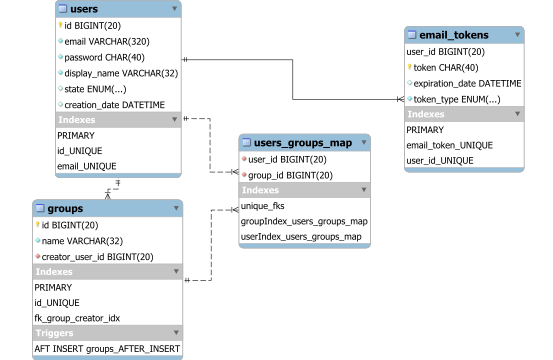

# MySql 8

## Naming conventions
Every table and every column must be lowecase and separate words must be separated by an underscore '*_*'.
E.g. *foo*, *foo_bar*

## Database design

> **_NOTE:_**  All required fields are marked with a star: **\*** below
## users
Table that stores all users in the system.

#### *id*
For *id* we decided to use Universal Unique Identifier (UUID). They are generated according to [RFC 4122](http://www.ietf.org/rfc/rfc4122.txt), “A Universally Unique IDentifier (UUID) URN Namespace”.

For this we use the new MySql 8 feature that allows expressions to be used as default values.

#### **email*
Email is also a unique trait of each user and they can be identified by it, however we recommend that you use id.
This field is VARCHAR(320) in compliance with the [SMTP standard](https://tools.ietf.org/html/rfc5321):

* [4.5.3.1.1](https://tools.ietf.org/html/rfc5321.html#section-4.5.3.1.1)  Local-par
      - The maximum total length of a user name or other local-part is 64 octets.

* [4.5.3.1.2](https://tools.ietf.org/html/rfc5321.html#section-4.5.3.1.2)  Domain
      - The maximum total length of a domain name or number is 255 octets.

#### **password*
Password is a fixed length hash of 40 characters.

#### **display_name*
For FrontEnd UI reasons the names of the users are restricted to 32 characters.

#### *state*
Each user can be in one of two states
* approved: email has been verified
* unapproved: email has not yet been verified

#### *creation_date*
default: current date

## *email_tokens*
All tokens sent by email go here.

#### **user_id*
The user's [*id*](#id) this generated token belongs to.

#### **token*
The actual 40 character long token.

#### *expiration_date*
After this date, the token can no longer be used.

#### **token_type*
Type of the token, we support two types:
* validation: used for validating email addressed
* password: used for creating forgotten password requests

## groups

#### *id*
Unique identifier for each group. (See user's [*id*](#id))

#### **name*
For FrontEnd UI reasons the names of the groups are restricted to 32 characters.

#### **creator_user_id*
The [*id*](#id) of the creator user for this particular group.

## users_groups_map
[Standard Junction](https://en.wikipedia.org/wiki/Associative_entity) table used for Many-to-Many relation for users and groups, one user can belong to multiple groups and one group contains multiple users.

#### **user_id*
The [*id*](#id) of the user that is in this group.

#### **group_id*
The [*id*](#id) of the group that this user is in.